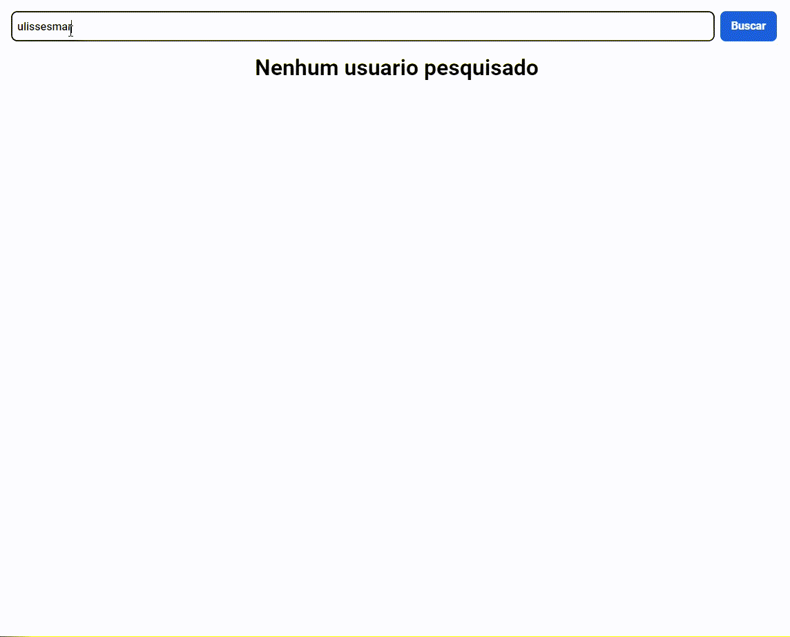

# Desafio de Projeto

Desafio de projeto para o Bootcamp Impulso e a Digital Inovaton One como intuito de componetizar um app/site com o React Js para facilitar e organizar todo o projeto otimizando a leitura e manutenção.

Na primeira imagem repliquei o projeto conforme os vídeos do desafio e na segunda imagem transformo o estilo em neon.

